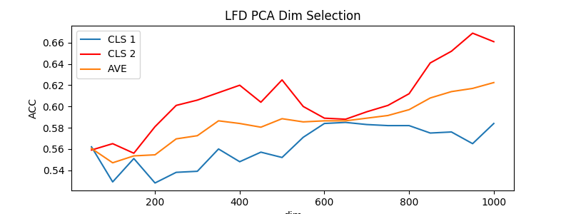
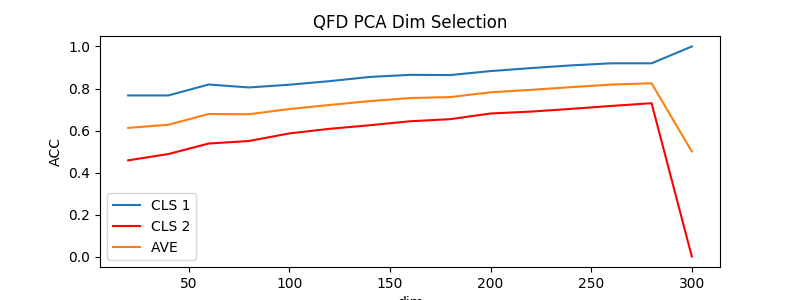

## Exercise
Using LDF and QDF to perform binary-classification on any two catagories of CIFAR-10 or MNIST or [HWDB](http://www.nlpr.ia.ac.cn/databases/handwriting/Download.html).
## Further Question
Using LDF and QDF to implement Multi-classification.
## Recommended Reference
http://scikit-learn.org/stable/modules/lda_qda.htm
## Performance
We evaluate QDF and LDF on Cifar-10. Similarly you may re-implement our code on MNIST.  
Class 1 (`6K` Training images): cat 
Class 2 (`6K` Training images): horse 
#### QDF :  
Each class contains `1K` test images.  
accuracy@Cls1 = `93.1%` 
accuracy@Cls2 = `73.0%` 
average acc = `83.1%` 
#### LDF :  
accuracy@Cls1 = `58.4%` 
accuracy@Cls2 = `66.1%` 
average acc = `62.3%` 
#### Details : 
We first reduce RGB channels to luminance channel((in YCrCb color space), which has been proved that human eyes are most sensitive to that dimension. The same as MNIST, luminance was shown in the gray image. E.g.

.png)

Then, the feature dimensions of each classes have been reduced from **3072** to **1024**.  
Moreover, we implement PCA on feature matrix (**12000x1024**) to further reduce the correlation of different features.  
This operation can also solve the problem of singular covariance matrix.  
Finally, we perform QDF and LDF on pre-processed features.
#### Principal Components Selection

