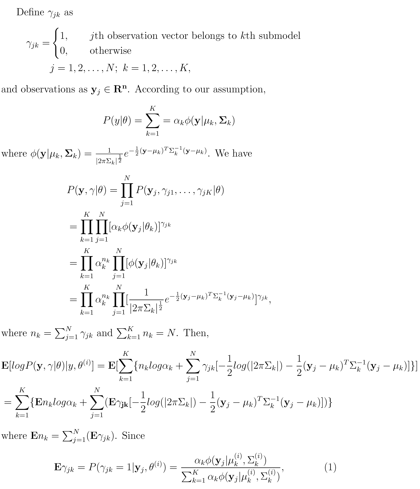
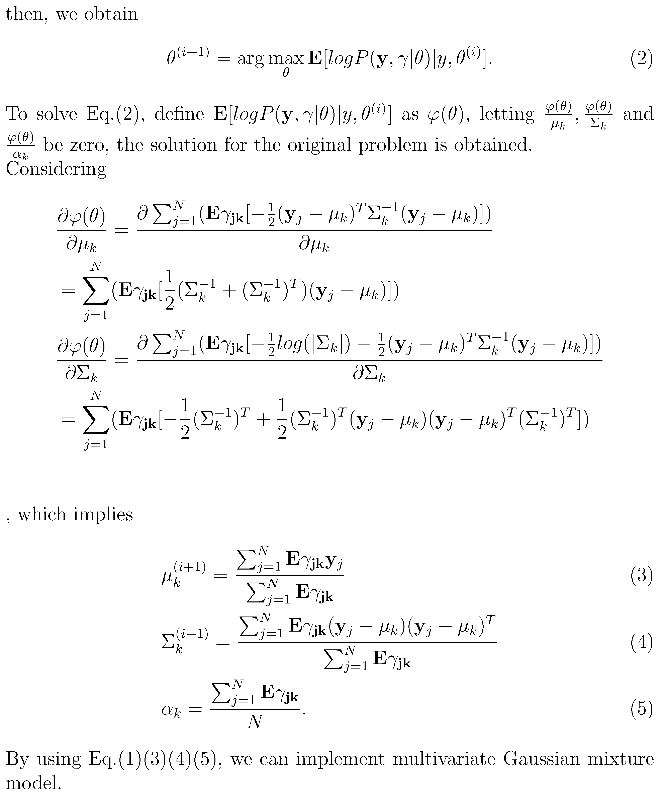
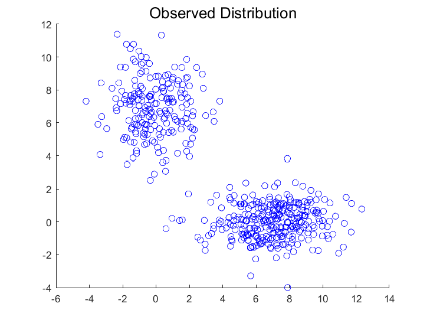
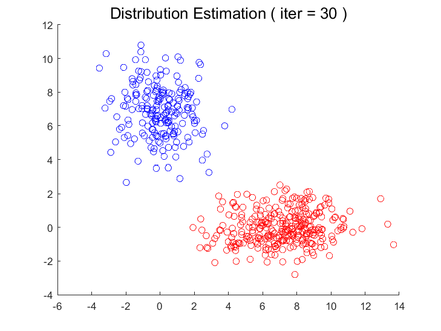
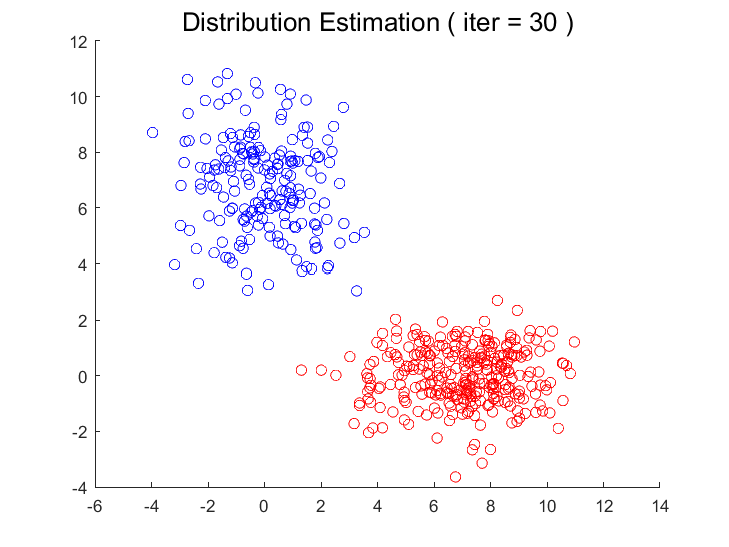
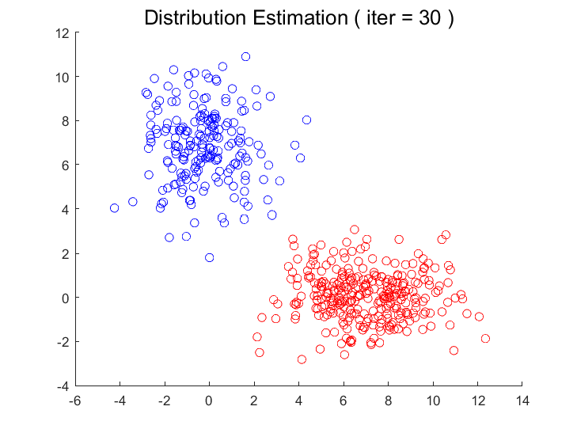

## Exercise
Given 5K smaples obey unknown gaussian mixture distribution (in the form of `a1*N(mu_1,Sigma_1)+a2*N(mu_2,Sigma_2)`),  
using [obversation vectors](https://github.com/HolmesShuan/UCAS-Pattern-Recognition/tree/master/Expectation-Maximization/data) to estimate a1, a2, mu_1, mu_2, Sigma_1 and Sigma_2. 

## Theorem & Proof

## Experiment Results

#### Observed feature distribution

#### Estimated distribution (initialization : mu_1=[0 7]; mu_2=[7 0]; Sigma_1 = Sigma_2 = I)

#### Estimated distribution (initialization : mu_1=[2 3]; mu_2=[5 1]; Sigma_1 = Sigma_2 = I)

#### Estimated distribution (initialization : mu_1=[2 3]; mu_2=[5 1]; Sigma_1 = Sigma_2 = 3\*I)
### Estimated Parameters :
##### Mu_1 = [0 7] Sigma_1 = [2.15 -0.125; -0.125 2.90]
##### Mu_2 = [7 0] Sigma_2 = [3.90  0.161;  0.161 1.06]
##### alpha_1 = 0.4; alpha_2 = 0.6
