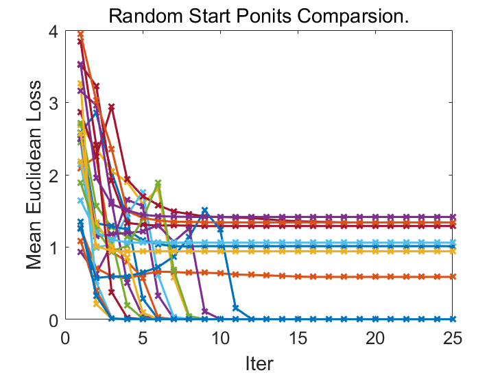

## Exercise
1. K-means, by using `./data/data.mat`
2. Spectral Clustering, by using `./data/data_2.mat`

## Different Start Points Comparsion
Euclidean distance to ideal class centers was reported.   

