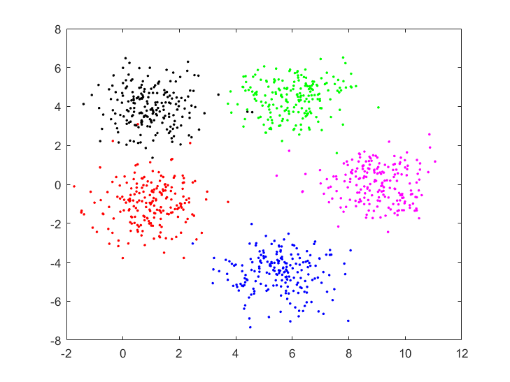
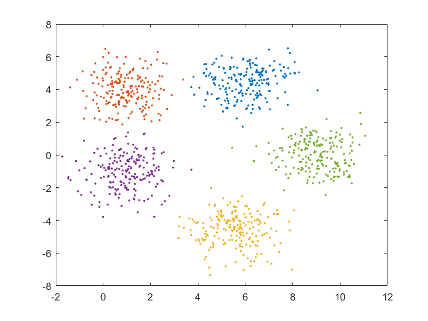
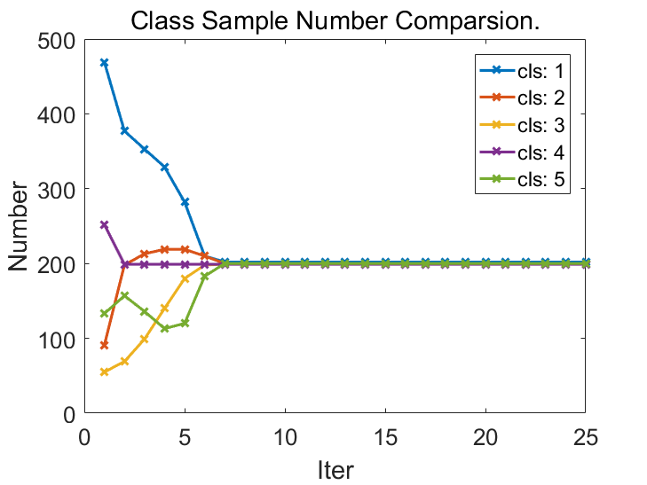
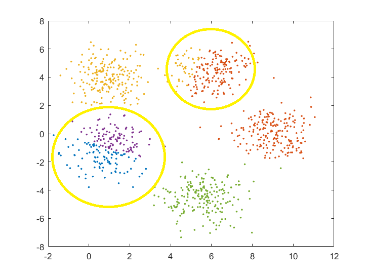
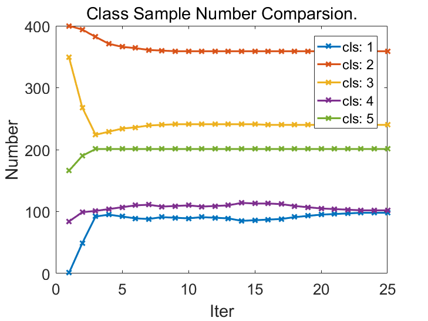
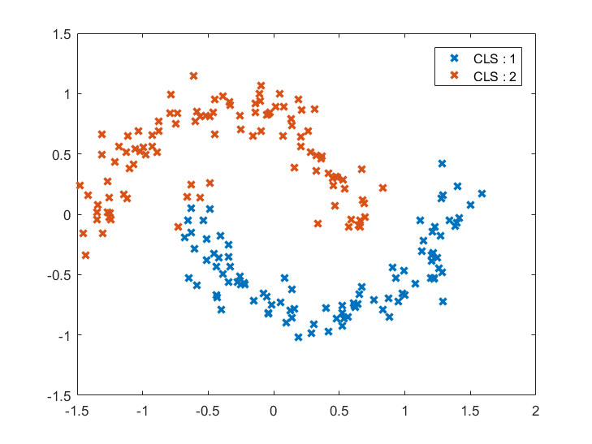
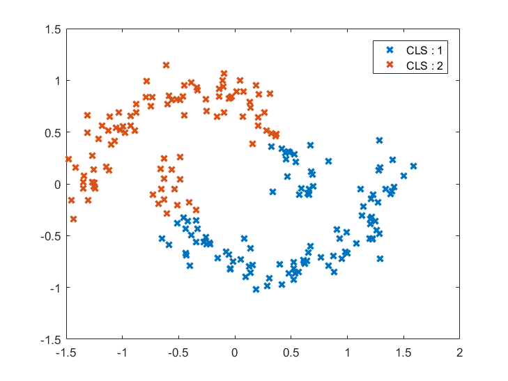
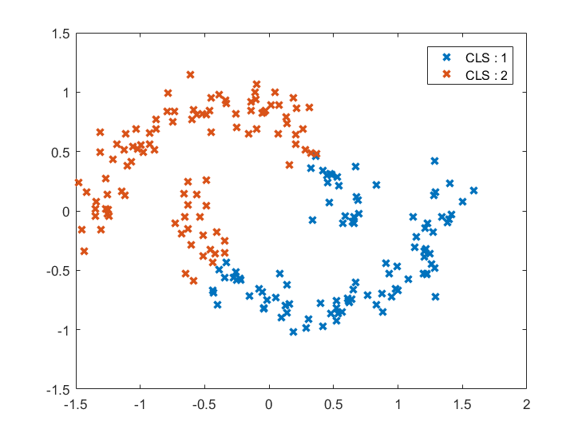

## Exercise
1. K-means, by using `./data/data.mat`
2. Spectral Clustering, by using `./data/data_2.mat`

## K-means
### Different Start Points Comparsion
The Euclidean distance to ideal class centers was reported. We selected initial points from `[min,max*U(0,1)]`.    
One may notice that K-means was not guaranteed to converge to the ideal class centers.

#### Ground Truth Classification

#### Perfect Classification

##### sample number of each class

#### Fair Classification

##### sample number of each class

## Spectral Clustering
`w_ij=exp(-||x-y||^2_2)/(2*sigma^2)` was used to measure the distance between point `x` and `y`.   
`L=D-W ==> L_sys=D^(-0.5)LD^(-0.5)`
### Hyperparameter Comparsion
We reported the accuracy, i.e. `acc=(n_1+n_2)/N`, under different `sigma` and `knn` settings.   

ACC | sigma=0.25 | sigma=0.5 | sigma=1 | sigma=2
------------ |------------ | ------------- |------------ |------------ 
k=15 | **100** | **100** | **100** | **100**
k=20 | **100** | 99.0 | 97.5 | 97.0
k=25 | **100** | 93.0 | 82.0 | 76.5
k=30 | **100** | 89.5 | 78.0 | 76.0

#### `sigma=1` with `k=15`

#### `sigma=1` with `k=20`

#### `sigma=1` with `k=25`

#### `sigma=1` with `k=30`

