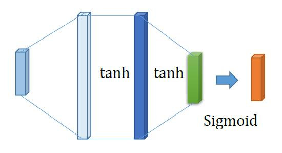

## Exercise
To construct a 3 layers forward neural network (fully connected) for 3 classification.
1. Euclidean Loss.
2. Tanh was used for hidden layers and Sigmoid for the output layer.
3. Evaluations based on different network structures, namely different numbers of hidden neurons.
4. Traning processs visualization.

## Data Distribution

