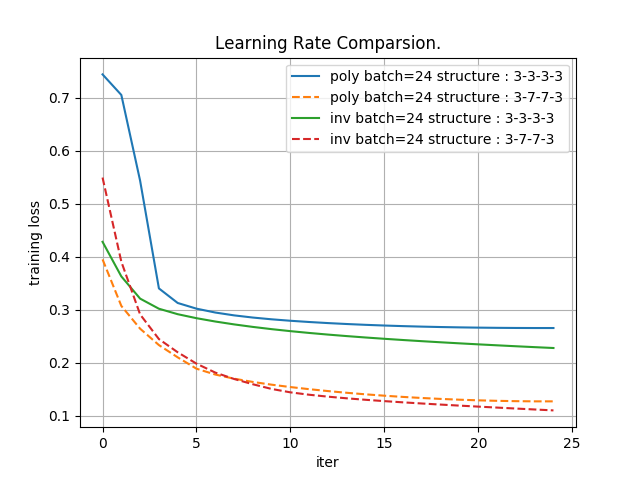
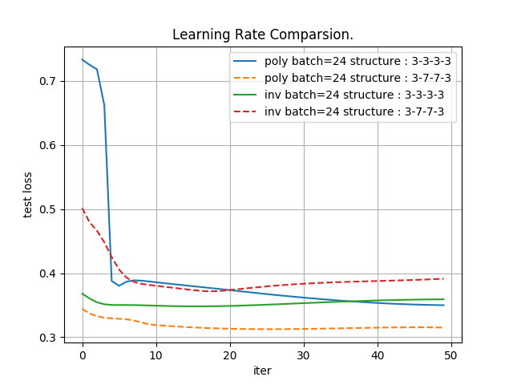
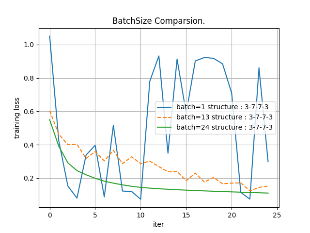
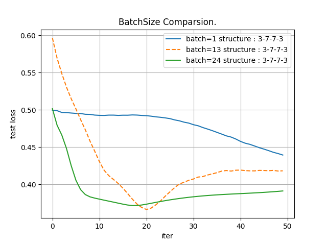
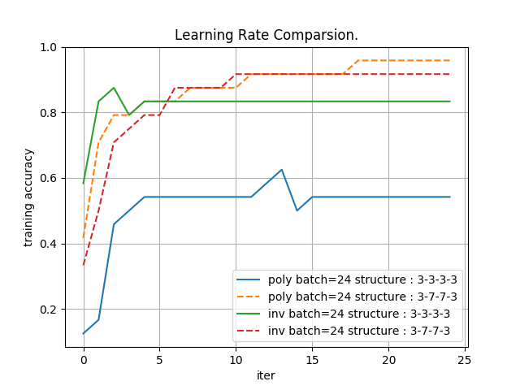
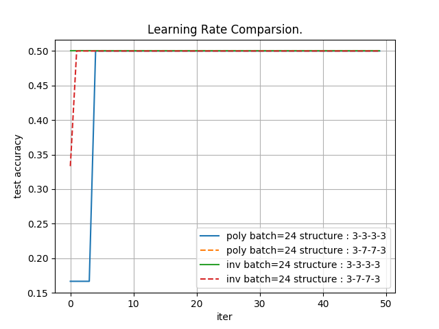

## Exercise
To construct a 3-layer forward neural network (fully connected) for three classification.
1. Euclidean Loss.
2. Tanh was used for hidden layers and Sigmoid for the output layer.
3. Evaluations based on different network structures, namely different numbers of hidden neurons.
4. Training process visualization.

## Network Structure
`3+3+3+3` or `3+7+7+3` denoted 3 input neurons with stacked 3 neurons or 7 neurons hidden layers.   
We created one-hot labels for each category, thus the number of output neurons was 3.   

## Data Distribution

## Hidden Neurons Comparsion
For training, 1 iter = 200 iterations; For testing, 1 iter = 100 iterations. We trained on `24` samples (`shuffled`) for 50K iterations and tested on `6` smaples (randomly selected two samples from each of the category) every 100 iterations.

## Learning Rate Comparsion
The base learning rate was `0.00005`. We compared `inv` and `poly` to show the effect of different learning strategies. The learning rate was gradually decreased with increasing iteration number. 
1. inv: return `base_lr * (1 + gamma * iter) ^ (- power)`
2. poly: the effective learning rate follows a polynomial decay, to be zero by the max_iter.    
return `base_lr (1 - iter/max_iter) ^ (power)`
3. `gamma=0.0001`   
4. `power=0.75`

## BatchSize Comparsion
For `batchsize=1`, the learning process corresponds to online learning. Our evaluations showed that small batchsize cannot generate steady gradient to the local minimum. 

## Accuracy Comparsion

